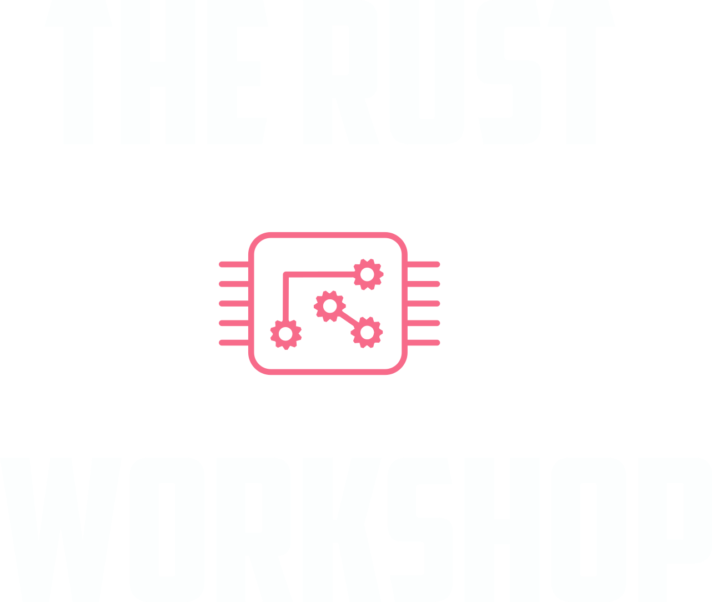
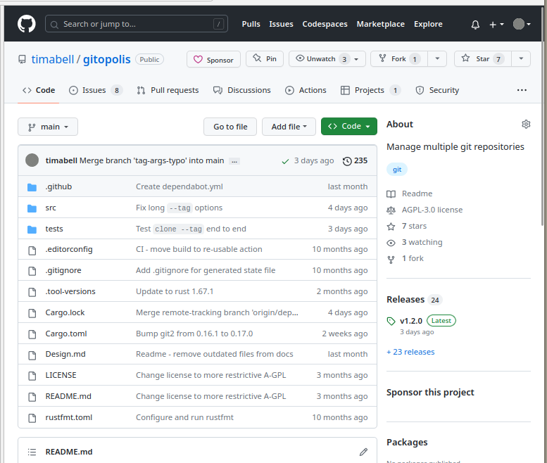

tmp talk design notes

**Speaker Notes:**

Talk design notes

* "Hero's journey".
* Teach something useful.

The journey:

1. Newbie - new to Rust, new project, but with existing experience of C# & Ruby
2. Chosen project - gitopolis (the journey)
3. What did I do & learn about DI & testing in Rust?
4. What can I teach you about it?
5. Back to normality, with extra skills under the belt.
6. What can I learn from you?

Things to cover:

1. Dependency Injection (D.I.) in C#
2. Styles of testing
3. Building Gitopolis in Rust
4. The objectives
5. "Traits" for runtime injection
6. Alternatives
7. Confident pull request merges
8. Questions

---


<!-- .slide: data-background="#111111" -->

## Dependency Injection <br> in Rust

<p>
<a href="https://twitter.com/tim_abell">

@tim_abell</a>
</p>

----

<div style="">
    <div ss="r-stack" style="float: left; height 200px; width: 450px;">
        
    </div>
    <div style="float: left; width: 500px;">
    <p style="margin: 25px 0 0 0;">
        Rust software engineering<br>for your business
    </p>
    <p style="margin: 20px 0 0 0;">
        <a href="https://rustworkshop.co/">rustworkshop.co</a>
    </p>
    </div>
    <div style="clear:both;"></div>
</div>

----

**Speaker Notes:**

* Me: C# Ruby etc -> Rust
* Talk: DI for Testing

---


## Building Gitopolis
<!-- .slide: class="no-bullets" -->

> "Manage multiple git repositories with ease."

- 🧑‍🎓 A project for learning Rust <!-- .element: class="fragment" -->
- 🏙️ Helps with microservices <!-- .element: class="fragment" -->
- 💞 Written with TDD <!-- .element: class="fragment" -->

[github.com/timabell/gitopolis](https://github.com/timabell/gitopolis)

**Speaker Notes:**


--



--

```bash [1|3-7|9-13|15-19]
$ gitopolis exec --tag tim -- git status

🏢 gitopolis> git status
On branch main
Your branch is up-to-date with 'origin/main'.

nothing to commit, working tree clean

🏢 schema-explorer> git status
On branch guid
Your branch is up-to-date with 'origin/guid'.

nothing to commit, working tree clean

🏢 timwise.co.uk> git status
On branch main
Your branch is up-to-date with 'origin/main'.

nothing to commit, working tree clean


```

---
<!-- .slide: class="no-bullets" -->

## Why DI?

* Pull Requests <!-- .element: class="fragment" -->
* My own regressions 😇 <!-- .element: class="fragment" -->
* Everything but the... 💽 <!-- .element: class="fragment" -->

**Speaker Notes:**

- tag-name refactoring fail
- speed

---

## "Traits" for runtime injection

- gitopolis end to end tests: https://github.com/timabell/gitopolis/blob/35f36053fa4da733de06887c83cfe73e19f504e1/tests/end_to_end_tests.rs
- injectable storage trait: https://github.com/timabell/gitopolis/blob/35f36053fa4da733de06887c83cfe73e19f504e1/src/storage.rs#L4

---

## Alternatives

---

<!-- .slide: class="no-bullets" -->
## 💬 Terminology

- Dependency Injection
- Mock
- Stub
- Fake
- Double
- Dummy 🍼
- Spy


**Speaker Notes:**

- **Stub**: Minimal predefined responses
- **Mock**: Verify expectations
- **Fake**: Limited capabilities, e.g. fake message bus
- **Dummy**: Unused, needed to satisfy contract
- **Spy**: Records information
- **Double**: All of the above, generic term

State verification (stubs) vs call verification (mocks) with "expectations".

- https://stackoverflow.com/questions/346372/whats-the-difference-between-faking-mocking-and-stubbing
- https://martinfowler.com/articles/mocksArentStubs.html

---

## Confident pull request merges

---

## Questions

---

<!-- .slide: data-background="#111111" -->

## Dependency Injection <br> in Rust

<p>
<a href="https://twitter.com/tim_abell">

@tim_abell</a>
</p>

----

<div style="">
    <div ss="r-stack" style="float: left; height 200px; width: 450px;">
        
    </div>
    <div style="float: left; width: 500px;">
    <p style="margin: 25px 0 0 0;">
        Rust software engineering<br>for your business
    </p>
    <p style="margin: 20px 0 0 0;">
        <a href="https://rustworkshop.co/">rustworkshop.co</a>
    </p>
    </div>
    <div style="clear:both;"></div>
</div>
